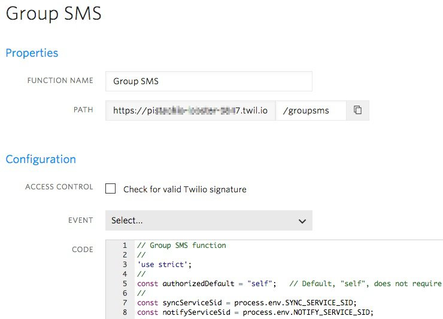
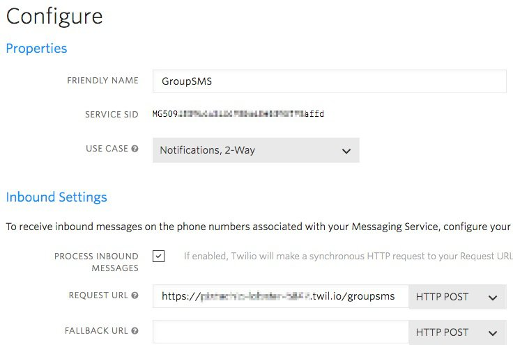
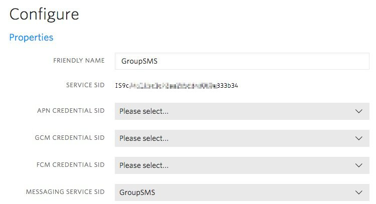
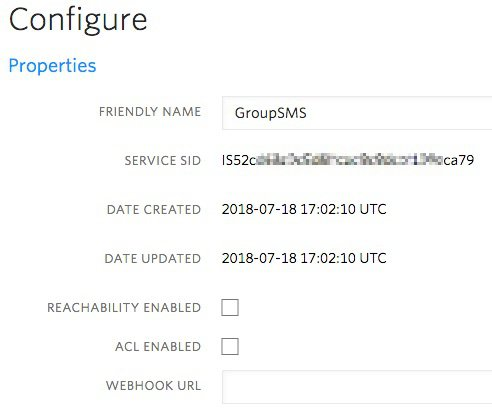

# Owl Group SMS Application

This is the documented steps to configure the Group SMS application using the Twilio Console.
After, is documentation for developers.

## Requirements:

- Twilio account. A free Trial account will work.
- For developers, Node.JS installed to run the Group SMS development programs locally on your computer.
Note, the Twilio Node.JS Helper Library is required.

## Configure Group SMS

````
Open a Twilio account to manage your Twilio resources:
https://www.twilio.com
For Group SMS, you are required you to upgrade your account.

Search and buy an SMS capable phone number:
https://www.twilio.com/console/phone-numbers/incoming
In these steps, I use +12223331234 as the example phone number.
The Twilio Phone Number is for members to send commands and broadcast messages.

Twilio Functions runs the Group SMS application.
Create a Function:
https://www.twilio.com/console/runtime/functions/manage
Click the Create a new Function icon. In the New Function popup, click Blank and click Create. Set:
Function name: Group SMS
Set the /path to /groupsms.
Copy and paste the code from this link: groupSms.js, into the Code text area.
Click Save.
````
Function screen print:


````
Create a Messaging Service(Twilio Copilot).
In a new tab (keep the Function tab open), go to:
https://www.twilio.com/console/sms/services 
Click Create new Messaging Service.
Friendly name: GroupSMS
Select: Notifications, 2-way
Click Create.
Click/enable Process Inbound Messages. For Request Url, enter your Functions URL (PATH).
   Example: https://about-time-1235.twil.io/groupsms.
Click Save.
On the left menu, click Numbers (Programmable SMS/ Messaging Services / GroupSMS / Numbers).
Click Add an Existing Number.
Click on your Twilio phone number, example: (222)333-1234.
Click Add Selected. Your number is now listed.
````
Note, the Twilio Copilot Messaging Service has attributes you can set to control the sending of messages. For Group SMS, use the defaults.

Messaging Service screen print:



````
Create a Notify Service to broadcast group messages:
https://www.twilio.com/console/notify/services
Click the Create new Notify Service icon.
Set, Friendly name: GroupSMS
Click Create. The Notify service configuration page is displayed.
Select your Messaging Service SID: GroupSMS.
Click Save.
````
Keep this tab open because the Notify service SID is used when configuring the Group SMS Twilio Function.

Notify Service screen print:


````
Create a Sync Service to manage the member data:
https://www.twilio.com/console/sync/services
Click the Create a new Sync Service icon.
Set, Friendly name: GroupSMS
Click Create.
````
Keep this tab open because the Sync service SID is used when configuring the Group SMS Twilio Function.

Sync Service screen print:


````
Configure the Function to use the Sync and Notify services:
https://www.twilio.com/console/runtime/functions/configure
Click/Enable ACCOUNT_SID and AUTH_TOKEN.
   This allows your Functions to use your account’s SID and auth token environment variables.
Do this for each key-value pair: click the create icon and add the following:
Key: NOTIFY_SERVICE_SID and value: your_notify_service_SID
Key: SYNC_SERVICE_SID and value: your_sync_service_SID
Click Save.
````

Sync Service screen print:


## Documentation for Developers

### Files

Programs to manage Sync service Map items:
- [1initDeleteMap.js](1initDeleteMap.js) : Delete a specific Sync Map Item, which deletes all the related Items.
- [2initCreateMap.js](2initCreateMap.js) : Given a Sync service, create a Map.
- [3initSmsSend.js](3initSmsSend.js)     : Send the initialization SMS message, "!init Harry".
- [4retrieveMaps.js](4retrieveMaps.js)   : List Sync Maps.
- [5smsList.js](5smsList.js)             : List received SMS message from the group phone number.
- [6smsSend.js](6smsSend.js)             : Send an SMS message to the group phone number.
- [groupSms.js](groupSms.js)             : Group SMS development program.
- [groupSmsFunction.js](groupSmsFunction.js) : Group SMS Twilio Function code based on groupSms.js.
- [createMapItem.js](createMapItem.js)   : Given a Sync service and a Map, create a Map Item.
- [retrieveMapItemsEach.js](retrieveMapItemsEach.js)       : Retrieve Sync service Map Items.
- [retrieveMapItemsForEach.js](retrieveMapItemsForEach.js) : Retrieve Sync service Map Items, method used in groupSms.js.
- [updateMapItemAuthorize.js](updateMapItemAuthorize.js)   : Update a specific Sync Map Item authorization value.
- [updateMapItem.js](updateMapItem.js)   : Update a specific Sync Map Item data.
- [echoVars.js](echoVars.js)             : Echo environment variables that are used in these Node.JS programs.
- [setvars.sh](setvars.sh)               : Set program environment variables.

After creating your Sync Service, create environment variables for use in these repository's programs:
````
ACCOUNT_SID=your_account_SID
AUTH_TOKEN=your_account_auth_token
SYNC_SERVICE_SID=your_sync_service_SID
SYNC_MAP_NAME=counters
export ACCOUNT_SID
export AUTH_TOKEN
export SYNC_SERVICE_SID
export SYNC_MAP_NAME
````
Note, you can use the shell script to maintain your variables ([setvars.sh](setvars.sh)).
````
Run using: source setvars.sh
````
Cheers,
Stacy David
